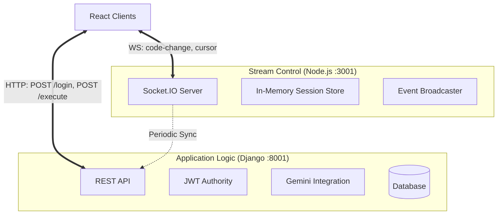

# CodeConnect - Comprehensive Technical Documentation

> **Version:** 2.1.0
> **Date:** January 9, 2026
> **Author:** Sunil
> **Repository:** `github.com/thatrasunil/code-connect`

---

## 1. Executive Summary

**CodeConnect** is a state-of-the-art collaborative development environment (CDE) engineered for technical interviews, peer programming, and educational mentorship. Unlike standard text editors, CodeConnect creates a synchronous "multiplayer" coding experience where developers can write, run, and debug code together in real-time.

The platform distinguishes itself by integrating **Google's Gemini AI** directly into the workflow, acting as a third "silent partner" that can explain complex algorithms, generate test cases, or act as a hint system for interview candidates.

### Core Philosophy
*   **Immediacy**: Use low-latency WebSockets (Node.js) for keystroke transformations, ensuring users never overwrite each other in a jarring way.
*   **Intelligence**: Leverage LLMs (Django + Gemini) to reduce context switching. Users shouldn't have to leave the IDE to search for syntax help.
*   **Simplicity**: A "Room" metaphor that requires zero setup. Just share a URL.

---

## 2. In-Depth Architecture

CodeConnect employs a **Hybrid Microservices-Monolith** pattern. We utilize the best tool for each specific domain: **Node.js** for high-concurrency real-time streams and **Django** for robust business logic and data modeling.

### 2.1 The Hybrid Backend Design



1.  **The Real-Time Layer (Node.js)**:
    *   Listens on port `3001`.
    *   Handles ephemeral state: temporary execution results, live cursor positions (`{line, column, userColor}`), and active participant lists.
    *   Uses **Socket.IO** rooms to isolate workspace contexts.
    *   **Why Node?**: Node's event loop is superior for handling thousands of concurrent WebSocket connections with minimal overhead compared to Django Channels.

2.  **The Business Layer (Django)**:
    *   Listens on port `8001`.
    *   Manages persistent state: User accounts, Room history, Chat logs, and Interview scores.
    *   Handles heavy lifting: Code execution sandboxing (Python-based wrapper), AI prompt construction, and secure file uploads.
    *   **Why Django?**: Provides a mature ORM for complex relationships (User <-> Room <-> Submission) and built-in security features.

---

## 3. User Flows & Personas

### 3.1 The "Interviewer" Persona
*Goal: Conduct a standardized technical assessment.*
1.  **Room Creation**: Interviewer logs in and creates a "Private Room".
2.  **Question Selection**: Opens the **Interview Panel** (Left Sidebar), browses the "Algorithms" library, and selects "Two Sum" (Medium).
3.  **Broadcast**: Clicks "Post to Editor". The problem description is inserted as comments into the shared code editor for the candidate to see.
4.  **Monitoring**: The interviewer can see the candidate's keystrokes in real-time.
5.  **Private Evaluation**: Uses the "Private Notes" tab to maximize the grading form. Writes feedback like "Candidate struggled with edge cases" and sets a score (e.g., 85/100).
6.  **Conclusion**: Saves the session. The score and notes are persisted to the `InterviewSession` table, visible only to them.

### 3.2 The "Candidate/Learner" Persona
*Goal: Solve a problem with assistance.*
1.  **Joining**: Accesses the room via a shared link (e.g., `/room/829102`). Enters as "Guest" if no account.
2.  **Coding**: Writings solution in `JavaScript`.
3.  **AI Assistance**: Gets stuck on a syntax error. Highlights the code block and clicks **"Explain Code"**.
    *   The frontend sends the snippet to Django.
    *   Django wraps it in a prompt: *"Explain this JavaScript code in simple terms..."*
    *   Gemini responds, and the explanation appears in the chat panel.
4.  **Verification**: Clicks "Run Code".
    *   Code is sent to `/api/execute`.
    *   System runs it against hidden test cases.
    *   Output panel slides up showing "Passed 3/5 Test Cases".

---

## 4. Technical Feature Specifications

### 4.1 Real-Time Synchronization Protocol
The frontend and Node.js backend communicate via specific socket events:

| Event Name | Direction | Payload | Description |
|------------|-----------|---------|-------------|
| `join-room` | C -> S | `{ roomId, userId }` | Handshake to enter a collaborative context. |
| `code-change` | Bidirectional | `{ roomId, code }` | The raw text content. Current strategy is "Last Write Wins". |
| `cursor-update` | Bidirectional | `{ roomId, pos: {line, ch}, user }` | Broadcasts user location for the "ghost cursor" effect. |
| `typing` | Bidirectional | `{ roomId, isTyping: true }` | Shows "Sunil is typing..." in chat/editor. |

### 4.2 AI "Brain" Integration
Located at `backend_django/core/ai_service.py`.
*   **Model**: `gemini-pro`.
*   **Security Scanning**: A specialized method `analyze_security(code)` prompts the model to look specifically for XSS/Injection vulnerabilities in user code.
*   **Error Handling**: Catches `ResourceExhausted` exceptions to gracefully handle API quota limits, returning user-friendly "System Busy" messages.

### 4.3 Code Execution Engine
Located at `backend_django/core/views_execution.py`.
*   **Sandboxing**: Currently utilizes a simplified Python `exec()` wrapper for JavaScript simulation.
    *   *Note*: This converts JS syntax (e.g., `function`, `console.log`) to Python equivalents for execution.
    *   **Limitations**: Does not support complex JS features like Promises or DOM interaction.
    *   **Roadmap**: Plan to replace this with a Docker-based **Judge0** instance for true multi-language support (C++, Java, Python, Go).

---

## 5. API Reference Guide (Django)

### Authentication
*   `POST /api/auth/signup`: Create new user.
*   `POST /api/auth/login`: Returns `access` and `refresh` JWTs.
*   `GET /api/auth/me`: Validates token and returns user profile.

### Room Management
*   `POST /api/create-room`: Returns `{ roomId: "12345678" }`.
*   `GET /api/room/{roomId}`: Full dump of room models + messages.
*   `GET /api/rooms/my-rooms`: List of rooms created by the authenticated user.

### Interview & Questions
*   `GET /api/questions`: Returns list of coding problems (id, title, difficulty).
*   `POST /api/rooms/{roomId}/session`: Saves `score` and `notes`.
*   `POST /api/questions/{id}/submit`: Submits final solution for grading.

---

## 6. Project Structure Map

### Frontend (`/frontend`)
*   `src/components/Editor.js`: **The Heart**. Contains the Monaco instance, Socket listeners, and panel layout logic.
*   `src/components/ChatPanel.js`: Handles message history, file uploads, and specific "AI Mode" rendering.
*   `src/contexts/AuthContext.js`: Global state for User/Token.
*   `src/config.js`: Centralized URL configuration.

### Backend Node (`/backend`)
*   `server.js`: **The Nervous System**. Single entry point handling all Socket.IO namespaces and MongoDB logging.

### Backend Django (`/backend_django`)
*   `core/models.py`: **The Memory**. Defines `User`, `Room`, `Message`, `Submission`.
*   `core/views.py`: General CRUD.
*   `core/views_execution.py`: The "Compiler" logic.
*   `core/ai_service.py`: The interface to Google Gemini.

---

## 7. Environment Configuration

To run CodeConnect locally, you must configure the following `.env` variables:

### Django (`backend_django/.env`)
```ini
# Security
SECRET_KEY=django-insecure-your-secret-key
DEBUG=True

# AI Capability
GOOGLE_API_KEY=AIzaSy... (Get from Google AI Studio)

# Database (Optional, defaults to SQLite)
# DB_NAME=codeconnect
# DB_USER=root
# DB_PASSWORD=password
```

### Frontend (`frontend/.env`)
```ini
# (Optional) Overrides for deployment
REACT_APP_BACKEND_URL=http://localhost:8001
REACT_APP_SOCKET_URL=http://localhost:3001
```

---

## 8. Deployment Strategy

### Frontend
Deploy as a static site (SPA) on **Vercel** or **Netlify**.
*   Build Command: `npm run build`
*   Output Directory: `build`

### Backends
Deploy on **Railway**, **Render**, or **Heroku**.
1.  **Django**: Requires a Python environment. Run `gunicorn codeconnect_backend.wsgi`.
2.  **Node.js**: Requires a Node environment. Run `npm start`.

*Note: Ensure `ALLOWED_HOSTS` in Django and `CORS` settings in both backends include your frontend domain.*
